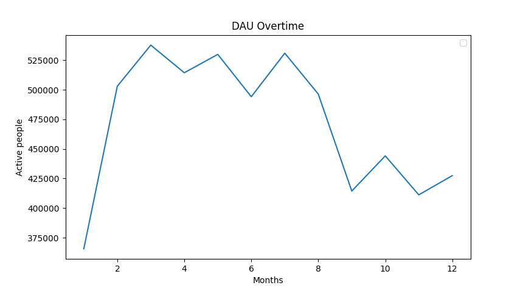

# Localization Data using SQL

The file sample.db is the file that contains all the data I will be working with for this project.

It contains sample data from a hypothetical free-to-play mobile game. Your task is to use this data set to answer the questions below and prepare a report of your findings. The report should be written to an audience of game and business developers, and it will be reviewed on actionability, insightfulness and clarity.

**About the Data:**
The database contains three tables: **account**, **account_date_session** and **iap_purchase**. **account** contains user profiles, **iap_purchase** contains in-app purchases by the users, and **account_date_session** contains the number of sessions for the users for the days they have been active. All the tables contain data for the year of 2016.

**The Questions**
1. Give a short description of datasets. 
    *A dataset is a way to store information in a organized tabular form, that is used for various purposes such as analysis, research, and machine learning. Datasets can be diverse and come from various sources, including scientific experiments, surveys, observations, or simulations.*
2. Analyse the daily active users:
    - Compare DAU changes over time.
    
    - Can you identify any trends in data?
    *There are spikes from February to August.* 
    - Can you find any ups or drops that are out of the normal behaviour?
    *There is a huge up from the January to March. There is a huge drop from July to September.*
    - What do you think why do they happen?
    *Half way in the year, players are not as active in the game. Around July, players are not as active as they were in the begining of the year.*
3. Analyse sales: 
    - Analyse the geographic split of the revenue and the users. [Output FIle](outputRevenueInfo.txt)
    - Calculate average revenue per user per market.
        1. $1053814.0
        2. $763092.0
        3. $562120.0
        4. $92376.0
        5. $4784.0
        6. $682281.0
        7. $2420.0
        8. $4620.0
        9. $3850.0
        10. $1080108.0
    - What are your observations of the results?
    *Most of the in-app purchases are from the US (30.941%), CN (26.745%), and KR (10.908%). Observations from the markets show that users purchase more from Market 10 at $1,080,108 revenue and less from Market 7 at $2,420 revenue.*